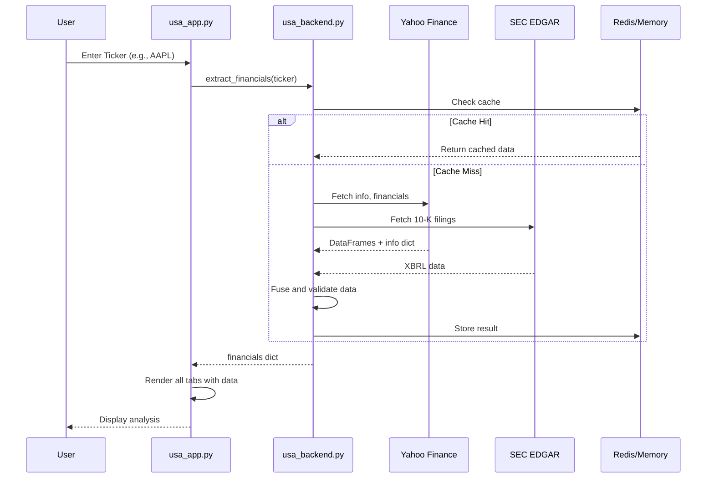

# ATLAS Financial Intelligence Engine - Complete Agent Context

## Executive Summary

**Project Name:** ATLAS Financial Intelligence Engine

**Type:** Streamlit-based financial analysis web application

**Primary Goal:** Professional-grade investment analysis tool for US equities

**Ultimate Objective:** Monetizable "cash machine" - VC-ready MVP

---

## Architecture Overview

```mermaid
flowchart TB
    subgraph frontend [Frontend - Streamlit]
        USA[usa_app.py - Main Router]
        DASH[dashboard_tab.py]
        ANAL[analysis_tab.py]
        SUMM[investment_summary.py]
        TABS[tabs/ - Modular Tab Files]
        FLIP[flip_cards.py - Metric Cards]
        VIZ[visualization.py - Plotly Charts]
        CSS[app_css.py + app_themes.py]
    end
    
    subgraph backend [Backend - Data Layer]
        BACK[usa_backend.py - Main Extractor]
        DICT[usa_dictionary.py - GAAP Terms]
        DCF[dcf_modeling.py - Valuation]
        QUANT[quant_engine.py - Factor Analysis]
    end
    
    subgraph datasources [External Data Sources]
        YF[Yahoo Finance - Primary]
        SEC[SEC EDGAR API]
        FMP[Financial Modeling Prep]
        AV[Alpha Vantage]
        FRED[FRED API - Risk Free Rate]
    end
    
    subgraph analysis [Analysis Modules]
        EARN[earnings_analysis.py]
        BAL[balance_sheet_health.py]
        CASH[cashflow_analysis.py]
        VAL[valuation_multiples.py]
        MGMT[management_effectiveness.py]
        GROW[growth_quality.py]
        FOREN[forensic_shield.py]
        GOV[governance_analysis.py]
    end
    
    USA --> DASH
    USA --> ANAL
    USA --> SUMM
    USA --> TABS
    BACK --> YF
    BACK --> SEC
    BACK --> FMP
    BACK --> AV
    DCF --> FRED
    DASH --> FLIP
    ANAL --> analysis
    VIZ --> USA
end
```

---

## Data Flow Pipeline



---

## File Structure

### Core Application Files

| File | Lines | Purpose |

|------|-------|---------|

| [usa_app.py](usa_app.py) | 3758 | Main Streamlit app - routing, sidebar, tabs |

| [usa_backend.py](usa_backend.py) | 2166 | Multi-source data extraction engine |

| [usa_dictionary.py](usa_dictionary.py) | 319 | GAAP financial term mappings |

### Tab Modules (Working)

| File | Lines | Purpose |

|------|-------|---------|

| [dashboard_tab.py](dashboard_tab.py) | 870 | Main dashboard with flip cards |

| [analysis_tab.py](analysis_tab.py) | 665 | Deep dive analysis |

| [investment_summary.py](investment_summary.py) | 1788+ | IC Memo with PDF export |

### Tab Modules (In tabs/ folder)

| File | Purpose |

|------|---------|

| [tabs/tab_data.py](tabs/tab_data.py) | Financial statements display |

| [tabs/tab_valuation.py](tabs/tab_valuation.py) | DCF model, scenarios |

| [tabs/tab_risk.py](tabs/tab_risk.py) | Forensic Shield, Governance |

| [tabs/tab_market.py](tabs/tab_market.py) | Technical, Quant, Options |

| [tabs/tab_news.py](tabs/tab_news.py) | News sentiment analysis |

### Analysis Modules

| File | Lines | Metrics Calculated |

|------|-------|-------------------|

| [earnings_analysis.py](earnings_analysis.py) | 365 | Beat rate, surprises, revisions |

| [balance_sheet_health.py](balance_sheet_health.py) | 519 | Liquidity, leverage, working capital |

| [cashflow_analysis.py](cashflow_analysis.py) | 350 | FCF quality, conversion, trends |

| [valuation_multiples.py](valuation_multiples.py) | 266 | P/E, EV/EBITDA, P/B, PEG |

| [management_effectiveness.py](management_effectiveness.py) | 423 | ROE, ROA, ROIC, efficiency |

| [growth_quality.py](growth_quality.py) | ~300 | Revenue CAGR, consistency |

| [forensic_shield.py](forensic_shield.py) | ~500 | Fraud detection, red flags |

| [governance_analysis.py](governance_analysis.py) | ~400 | Board quality, compensation |

### Valuation Engine

| File | Lines | Purpose |

|------|-------|---------|

| [dcf_modeling.py](dcf_modeling.py) | 920 | 3-scenario DCF with WACC |

| [live_dcf_modeling.py](live_dcf_modeling.py) | ~600 | Interactive DCF with sliders |

| [reverse_dcf.py](reverse_dcf.py) | ~300 | Implied growth from price |

| [monte_carlo_engine.py](monte_carlo_engine.py) | ~500 | DCF simulation (NOT INTEGRATED) |

### UI Components

| File | Lines | Purpose |

|------|-------|---------|

| [flip_cards.py](flip_cards.py) | 688 | CANONICAL flip card component |

| [visualization.py](visualization.py) | 780 | Plotly chart factory |

| [app_css.py](app_css.py) | ~800 | Global CSS styles |

| [app_themes.py](app_themes.py) | ~300 | Theme system (blue theme) |

| [app_landing.py](app_landing.py) | ~200 | Landing page |

### Utility Modules

| File | Purpose |

|------|---------|

| [utils/ticker_mapper.py](utils/ticker_mapper.py) | Ticker alias handling (ZOOM to ZM) |

| [utils/logging_config.py](utils/logging_config.py) | Centralized logging |

| [utils/redis_cache.py](utils/redis_cache.py) | Redis caching for API calls |

| [utils/security.py](utils/security.py) | Security utilities |

### Data Source Connectors

| File | Purpose |

|------|---------|

| [data_sources/fred_api.py](data_sources/fred_api.py) | FRED API for risk-free rate |

| [data_sources/sec_edgar.py](data_sources/sec_edgar.py) | SEC EDGAR filings |

| [data_sources/fmp_earnings.py](data_sources/fmp_earnings.py) | FMP earnings data |

| [data_sources/sector_benchmarks.py](data_sources/sector_benchmarks.py) | Industry benchmarks |

---

## Data Structure

### Main financials Dict (from usa_backend.py)

```python
{
    "ticker": "AAPL",
    "company_name": "Apple Inc.",
    "status": "success",
    "source": "yfinance",  # or "sec" or "hybrid"
    
    # Core DataFrames
    "income_statement": pd.DataFrame,  # Rows=metrics, Cols=years
    "balance_sheet": pd.DataFrame,
    "cash_flow": pd.DataFrame,
    
    # Pre-calculated (from yfinance info)
    "info": {
        "currentPrice": 195.50,
        "marketCap": 3000000000000,
        "trailingPE": 32.5,
        "forwardPE": 28.1,
        "returnOnEquity": 0.156,
        "sharesOutstanding": 15400000000,
        # ... 100+ fields
    },
    
    # Derived metrics
    "ratios": pd.DataFrame,
    "per_share_data": pd.DataFrame,
    "growth_rates": {...},
    
    # Quant analysis (if requested)
    "quant_analysis": {
        "beta": 1.25,
        "sharpe_ratio": 1.8,
        "fama_french_factors": {...}
    },
    
    # Metadata
    "extraction_time": 3.2,
    "data_completeness": 0.95
}
```

---

## Current Tab Structure (8 Tabs)

| Tab | Name | Implementation | Status |

|-----|------|----------------|--------|

| 1 | Dashboard | dashboard_tab.py | WORKING |

| 2 | Data | tabs/tab_data.py | WORKING |

| 3 | Deep Dive | analysis_tab.py | WORKING |

| 4 | Valuation | tabs/tab_valuation.py | PARTIAL - DCF only |

| 5 | Risk and Ownership | tabs/tab_risk.py | PARTIAL |

| 6 | Market Intelligence | tabs/tab_market.py | WORKING |

| 7 | News | tabs/tab_news.py | WORKING |

| 8 | IC Memo | investment_summary.py | WORKING |

---

## Key Technical Details

### WACC Calculation (dcf_modeling.py)

```python
# Beta adjustment (Bloomberg method)
adjusted_beta = 0.67 * raw_beta + 0.33

# Cost of Equity (CAPM)
cost_of_equity = risk_free_rate + adjusted_beta * equity_risk_premium

# WACC
wacc = (E/V) * cost_of_equity + (D/V) * cost_of_debt * (1 - tax_rate)
```

### Data Source Priority

1. **Yahoo Finance (yfinance)** - Primary source for most data
2. **SEC EDGAR** - 10-K/10-Q filings, CIK lookup
3. **Financial Modeling Prep** - Earnings, analyst estimates
4. **Alpha Vantage** - Alternative data source
5. **FRED API** - Treasury rates for risk-free rate

### Flip Cards Color Coding

| Color | Meaning | Example |

|-------|---------|---------|

| Green | Good/Positive | ROE > 15% |

| Red | Bad/Negative | D/E > 2.0 |

| Yellow | Neutral/Caution | - |

| Blue | No benchmark | Market Cap |

---

## Known Issues and Limitations

### Critical Issues

1. **Small/Mid Cap Coverage** - Returns N/A for most metrics on stocks like NBSM, VBR, SMCC because `info.get()` is sparse
2. **SEC Rate Limiting** - SEC API sometimes blocks requests
3. **Yahoo Finance Rate Limiting** - Can hit limits on Streamlit Cloud shared IP

### Partial Implementation

| Feature | Status | Issue |

|---------|--------|-------|

| Insider Transactions | Code exists | Not wired in main app |

| Institutional Ownership | Code exists | Not wired in main app |

| Earnings Revisions | Code exists | Not wired in main app |

| Monte Carlo | Code exists | Not integrated |

| Enhanced PDF | Code exists | Not integrated |

### Files to DELETE (Duplicates)

- flip_card_component.py
- flip_card_v2.py
- flip_card_integration.py
- analysis_tab_metrics.py
- data_tab_metrics.py

---

## User Requirements and Constraints

### Hard Rules

1. **NO EMOJIS** - User explicitly banned emojis in code/UI
2. **NASA Accuracy** - Verify everything before claiming done
3. **No AI Slop** - Distinctive professional design, not generic
4. **Test Before Done** - Previous multi-agent failure was from not testing

### Performance Targets

| Metric | Target | Current |

|--------|--------|---------|

| Initial Load | less than 5 sec | ~10-15 sec |

| Ticker Search | less than 5 sec | ~5-8 sec |

| Tab Switch | less than 1 sec | ~1-2 sec |

### Design Preferences

- Blue theme (glassmorphism style)
- Professional financial terminal aesthetic
- Clear typography, readable fonts
- Minimal but informative

---

## Session Interaction Guidelines

### Do:

- Be direct, no fluff
- Admit when unsure - "I don't know" is acceptable
- Test all changes before marking complete
- Follow existing code patterns
- Use existing abstractions

### Do NOT:

- Add features not explicitly requested
- Use emojis anywhere
- Claim "done" without verification
- Over-engineer simple fixes
- Create new abstractions for one-time operations

### Questions to Ask:

- "Should I proceed with X or wait for confirmation?"
- "I found issue Y - fix now or add to plan?"
- "This will take ~X hours - proceed?"

---

## API Keys and Environment

Required environment variables:

- `FMP_API_KEY` - Financial Modeling Prep
- `ALPHA_VANTAGE_API_KEY` - Alpha Vantage
- `GROQ_API_KEY` - AI assistance (optional)
- `FRED_API_KEY` - FRED API (optional, has fallback)

---

## Deployment

- **Platform:** Streamlit Cloud
- **Branch:** main (production), search_update (development)
- **Config:** [railway.toml](railway.toml), [Procfile](Procfile)
- **Requirements:** [requirements.txt](requirements.txt)

---

## Quick Start for New Agent

```
1. Read this context document fully
2. Read any active plan files in .cursor/plans/
3. Understand the current task before making changes
4. Test locally: streamlit run usa_app.py
5. Verify changes work before committing
6. Push only after user confirmation
```

---

## Related Plans

- [Universal Stock Coverage Plan](.cursor/plans/universal_stock_coverage_678f3d36.plan.md) - Add fallback calculations for small caps
- [USA App Rewrite Plan](.cursor/plans/5649ac4a-c347-4775-9bee-e4826bd176ba/Subtle.plan.md) - Modular refactoring

---

*Last Updated: December 2024*

*Comprehensive context for AI agents working on ATLAS Financial Intelligence Engine*